# GitHub Copilot App — Technical Preview

---

## Table of contents

- [What is the GitHub Copilot App?](#what-is-the-github-copilot-app)
- [The complete flow, step by step](#the-complete-flow-step-by-step)
- [⚠️ Microsoft/GitHub's master move: a statement of intent](#️-microsoftgithubs-master-move-a-statement-of-intent)
- [Full flow summary](#full-flow-summary)
- [Availability](#availability)

---

## What is the GitHub Copilot App?

The **GitHub Copilot App** is a native desktop experience from GitHub for agentic development. Its purpose is to start from the work you already have on GitHub (issues, PRs, prior sessions), keep that work isolated, guide it as it progresses, and land the change through the usual pull request process.

In short: the agent writes code, runs tests, opens PRs, and manages reviews while you supervise.

---

## The complete flow, step by step

The images below follow the actual order of use: first the operating modes, then the session setup/execution, and finally the complete PR block.

---

### Step 1 — The home screen: operating modes

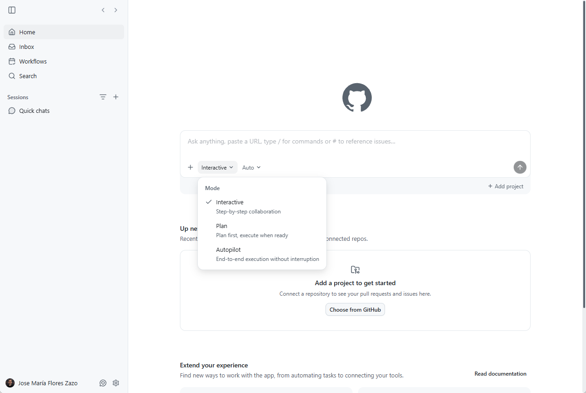

The main screen of the GitHub Copilot App shows the session **mode** selector:

| Mode | Description |
|---|---|
| **Interactive** | Step-by-step collaboration (the agent asks before acting) |
| **Plan** | Plans first, executes when you're ready |
| **Autopilot** | End-to-end execution without interruptions |

For exploration cases or when scope is unclear, **Interactive** is the natural starting point. For well-defined and repeatable tasks, **Autopilot** maximizes agent autonomy.

---

### Step 2 — Available model selection

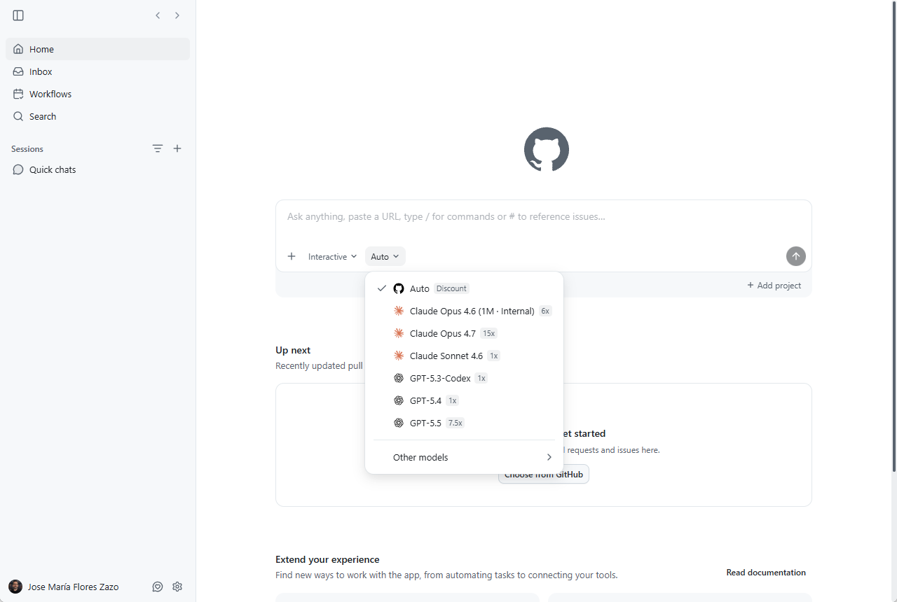

When creating a session you can choose which model to use. The **Auto** dropdown automatically picks the optimal model with a price discount. Options available at the time of preview:

| Model | Cost multiplier |
|---|---|
| Auto | Discount |
| Claude Opus 4.6 (1M · Internal) | 6× |
| Claude Opus 4.7 | 15× |
| Claude Sonnet 4.6 | 1× |
| GPT-5.3-Codex | 1× |
| GPT-5.4 | 1× |
| GPT-5.5 | 7.5× |

> The example session in this tutorial used **Claude Sonnet 4.6**, an optimal balance between quality and cost.

---

### Step 3 — Repositories available in your account

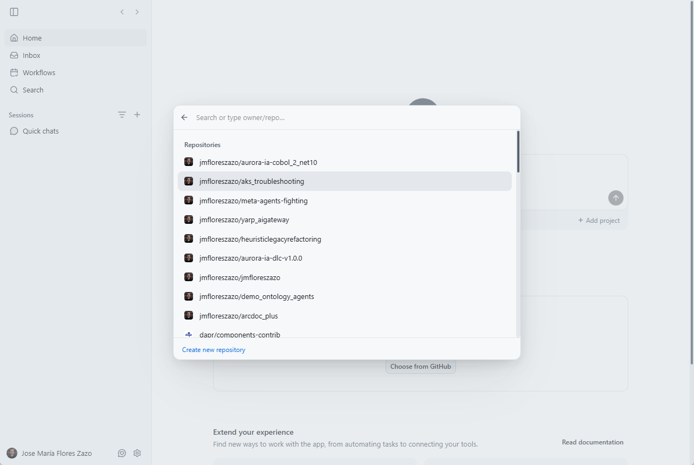

When adding a project to the app, the repository selector unfolds. In the `jmfloreszazo` account you can see, among others:

- `aurora-ia-cobol_2_net10`
- `aks_troubleshooting`
- `meta-agents-fighting`
- `yarp_aigateway`
- `heuristiclegacyrefactoring`
- `demo_ontology_agents`
- `arcdoc_plus`
- (external contributions such as `dapr/components-contrib`)

The app connects to any repo in your account or in organizations you belong to.

---

### Step 4 — Create a new repository from the app

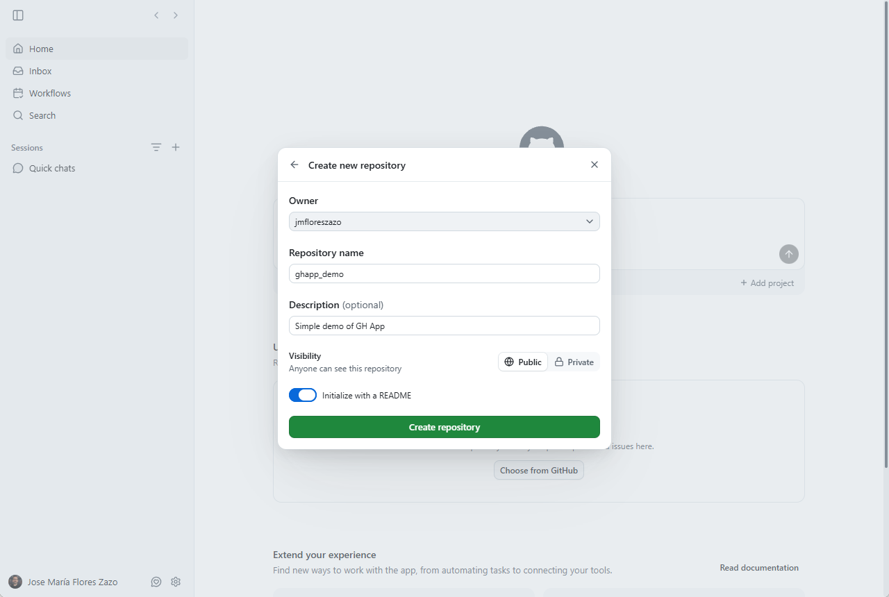

If the repository doesn't exist, it can be created directly from the interface without leaving the app:

- **Owner**: `jmfloreszazo`
- **Repository name**: `ghapp_demo`
- **Description**: `Simple demo of GH App`
- **Visibility**: Public / Private
- Option to initialize with a README

Once created, it stays linked to the active project.

---

### Step 5 — Where to run the session: worktree or local repo

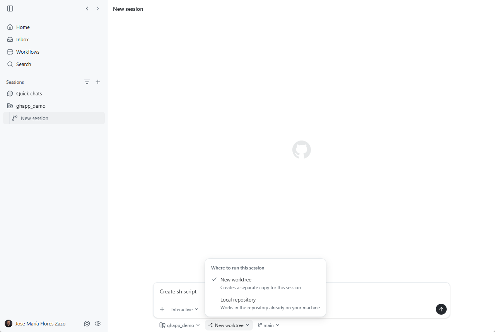

Before launching the first session, the app asks **where to run the work**:

- **New worktree** — creates an isolated copy of the repo just for this session. Recommended: the agent works on its own branch without interfering with the main code.
- **Local repository** — works directly on the repository already cloned on the machine.

> For agentic work, `New worktree` is the safe option: each session lives in its own space.

#### Technical sub-point — what's actually different

`New worktree` uses `git worktree` to create an additional working directory of the same repository, typically associated with a dedicated branch for the agent's session.

Key differences:

- **Change isolation**: each worktree has its own file state and its own active branch.
- **Less operational risk**: you avoid mixing the agent's changes with your main working directory (staged files, stashes, or local changes).
- **Correct Git model for parallelism**: you can have multiple sessions/agents working in parallel on different branches without stepping on each other.
- **Same history, different folder**: worktrees share the repo's Git object store, but each has its own independent checkout.

`Local repository`, on the other hand, runs against your main checkout. It's useful for fast iterations, but it increases the risk of interfering with manual work in progress.

#### Sub-point — On-disk file structure (worktree)

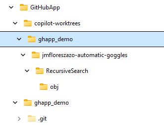

The app organizes work in the file system in a predictable way:

```text
GitHubApp/
└── copilot-worktrees/
    └── ghapp_demo/
        └── jmfloreszazo-automatic-goggles/   <- session worktree
            └── RecursiveSearch/
                └── obj/
    ghapp_demo/                                 <- base cloned repo
    └── .git/
```

Each session has its own isolated directory inside `copilot-worktrees`. There's no risk of one session stepping on another's work.

---

### Step 6 — Project configuration: instructions and automation

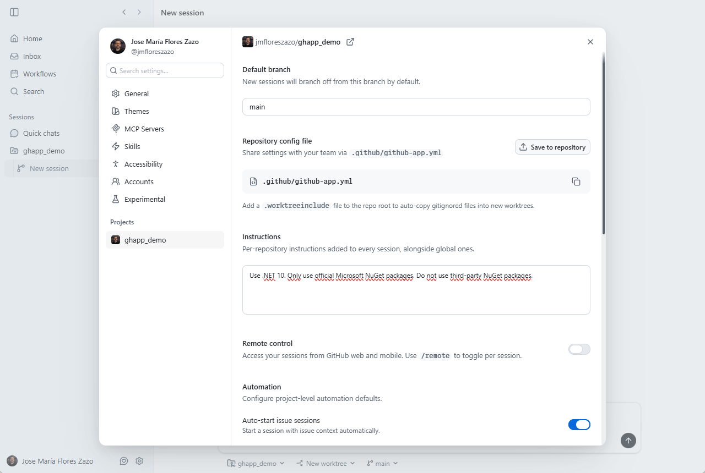

In **Settings → Projects → ghapp_demo** you define the rules the agent will follow in every session for that repository:

```
Use .NET 10. Only use official Microsoft NuGet packages.
Do not use third-party NuGet packages.
```

Other configurable parameters:

- **Default branch**: `main`
- **Repository config file**: `.github/github-app.yml` (shareable with the team)
- **Remote control**: access sessions from GitHub web and mobile (`/remote` command)
- **Auto-start issue sessions**: automatically starts a session when an issue is opened

---

### Step 7 — Skills available to the agent

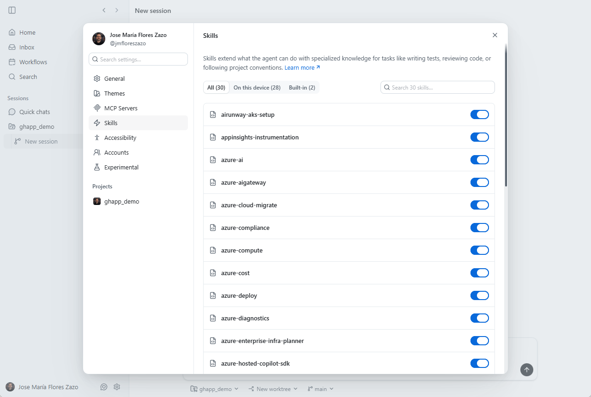

The **Skills** tab shows the specialized capabilities the agent can use. In this case there are 30 skills installed (28 on the device + 2 built-in), all enabled. Examples:

- `airunway-aks-setup`
- `appinsights-instrumentation`
- `azure-ai`, `azure-aigateway`, `azure-cloud-migrate`
- `azure-compliance`, `azure-compute`, `azure-cost`
- `azure-deploy`, `azure-diagnostics`
- `azure-enterprise-infra-planner`
- `azure-hosted-copilot-sdk`

Skills extend what the agent knows how to do in a specialized way, such as following project conventions or reviewing code with specific criteria.

---

### Step 8 — First session: the initial prompt

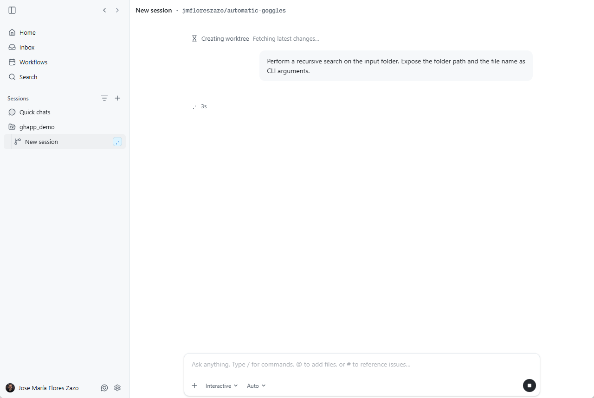

With the repository configured, the first session is launched with the prompt:

> *"Perform a recursive search on the input folder. Expose the folder path and the file name as CLI arguments."*

The app creates the worktree (`jmfloreszazo-automatic-goggles`), pulls the latest changes from the repo, and the agent starts working. At this point the session appears in the left panel as **New session** under the `ghapp_demo` project.

---

### Step 9 — The agent builds the code: real-time diff

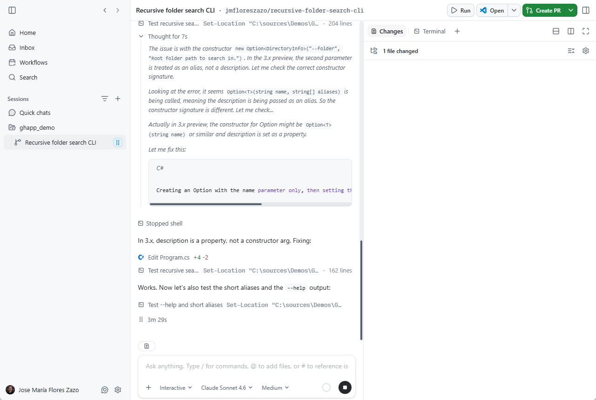

The right panel shows the **diff** of changes as the agent writes. Here the agent generated `RecursiveSearch/Program.cs` with +77 lines:

```csharp
using System.CommandLine;
using System.CommandLine.Parsing;

var folderOption = new Option<DirectoryInfo>("--folder")
{
    Description = "Root folder path to search in.",
    Required = true
};
folderOption.Aliases.Add("-f");

var fileNameOption = new Option<string>("--filename")
{
    Description = "File name (or pattern, e.g. *.txt) to search for.",
    Required = true
};
fileNameOption.Aliases.Add("-n");

var rootCommand = new RootCommand("Recursively searches for a file inside a folder.")
{
    folderOption,
    fileNameOption
};

rootCommand.SetAction((ParseResult result) =>
{
    var folder = result.GetValue(folderOption)!;
    var fileName = result.GetValue(fileNameOption)!;

    if (!folder.Exists)
```

The agent detected that the `System.CommandLine 3.x preview` API had changed (description as a property, not as a constructor parameter) and corrected the code automatically.

---

### Step 10 — The agent fixes compilation errors on its own

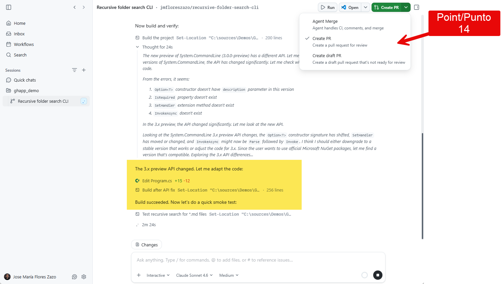

When the build failed, the agent showed its internal reasoning (*Thought for 24s*):

> *"The new preview of System.CommandLine (3.0.0-preview) has a different API... Option\<T\> constructor doesn't have description parameter in this version. IsRequired property doesn't exist. SetHandler extension method doesn't exist. InvokeAsync doesn't exist..."*

The agent looked up the correct API for version 3.x, adapted the code, recompiled, and verified that the build was successful before continuing. It required no manual intervention.

---

### Step 11 — Open tools (VS Code, Terminal, PowerShell) from the app

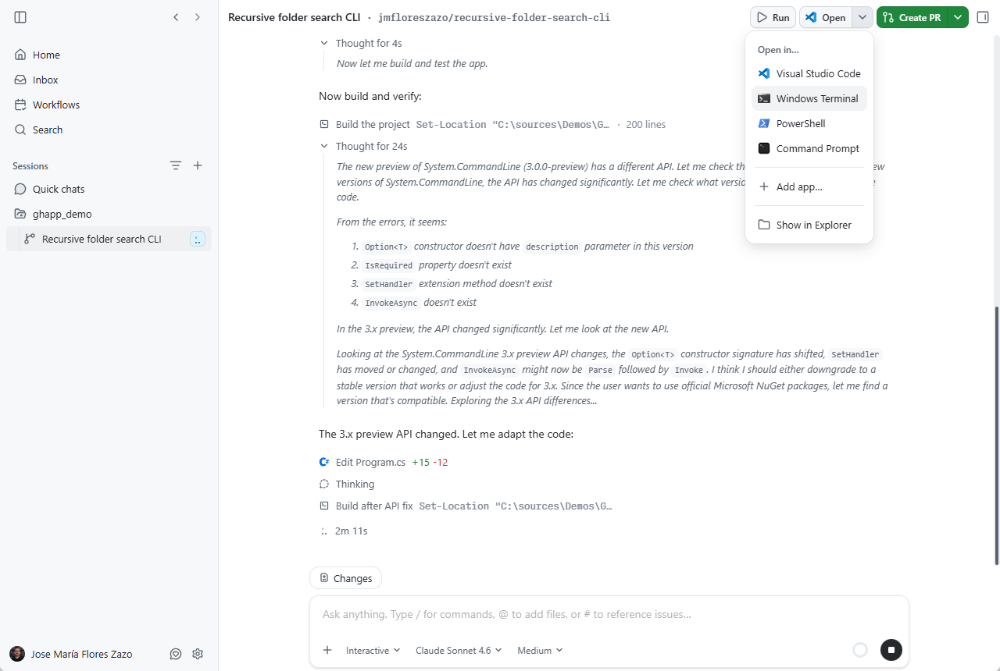

The **Open** button in the top bar lets you open the active worktree directly in different tools:

- **Visual Studio Code**
- **Windows Terminal**
- **PowerShell**
- **Command Prompt**
- Or add a custom application

This lets you switch quickly between editor and terminals without leaving the session context.

---

### Step 12 — The code in VS Code

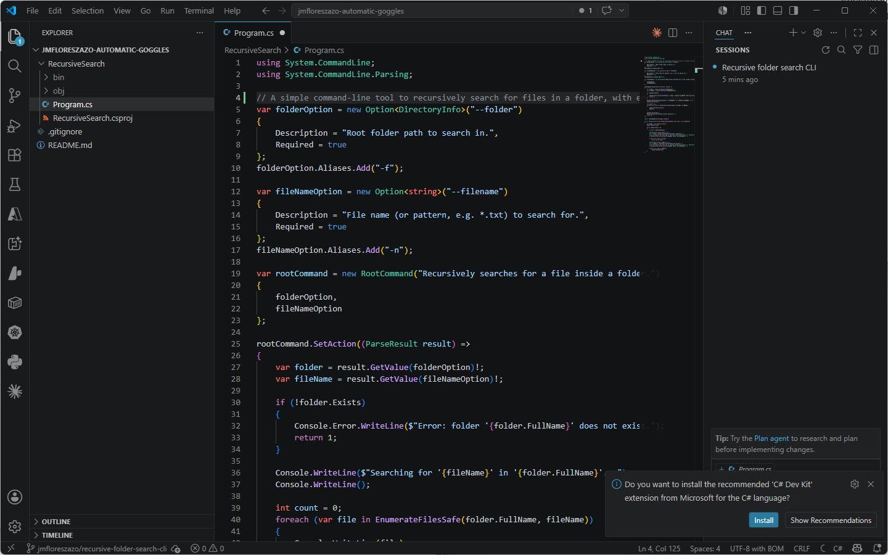

In VS Code you can see the full project generated by the agent:

```
JMFLORESZAZO-AUTOMATIC-GOGGLES/
└── RecursiveSearch/
    ├── bin/
    ├── obj/
    ├── Program.cs          ← main app
    ├── RecursiveSearch.csproj
    ├── .gitignore
    └── README.md
```

The right panel of VS Code shows the chat for the active session so you can keep interacting with the agent from the editor.

---

### Step 13 — Using the CLI from inside the app environment

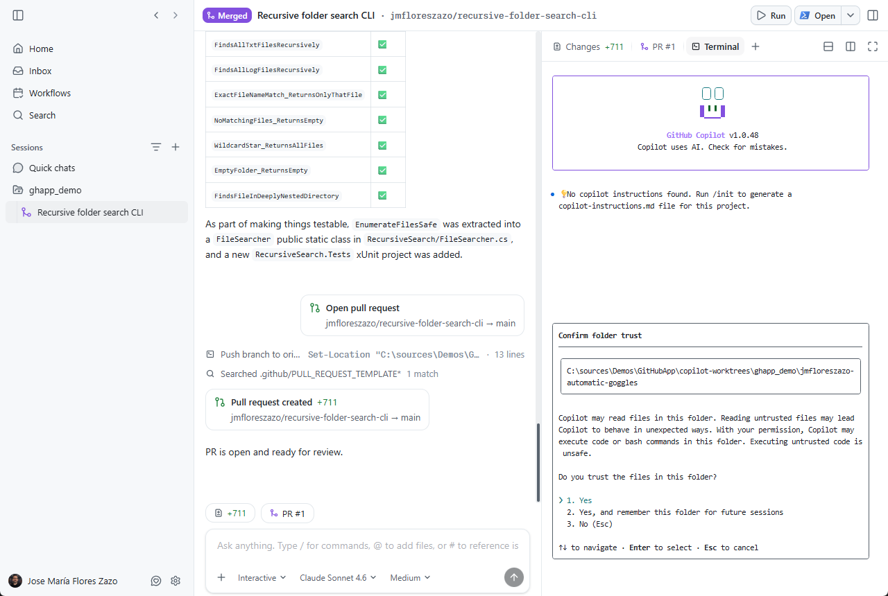

This step shows that you can use the CLI directly (Terminal, PowerShell, or Command Prompt) without leaving the app environment. The first time the agent needs to execute code in the worktree, a **trust confirmation** dialog appears:

```
C:\sources\Demos\GitHubApp\copilot-worktrees\ghapp_demo\jmfloreszazo-automatic-goggles
```

> *"Copilot may read files in this folder... With your permission, Copilot may execute code or bash commands in this folder. Executing untrusted code is unsafe."*

Trust options:
1. **Yes** — trust for this session
2. **Yes, and remember this folder for future sessions**
3. **No (Esc)**

Once trust is granted, you can run CLI commands in the worktree from the app experience itself.

---

### Step 14 — Unified PR flow (step by step)

1. **The Create PR option appears**  
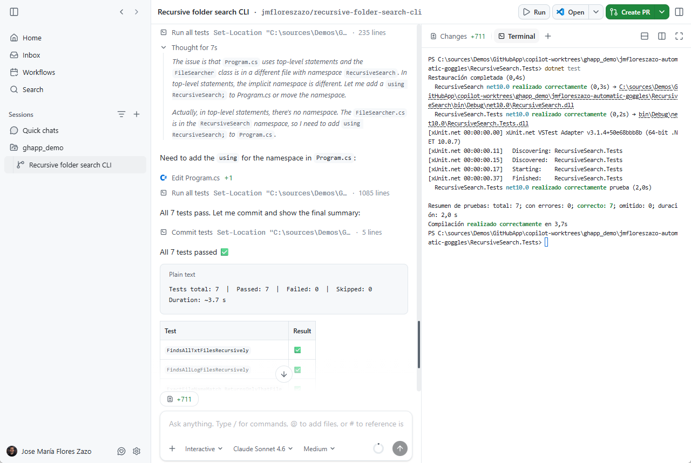

Once the code is ready and tests have passed, the **Create PR** button appears with three options:

- **Agent Merge** — the agent handles review comments, CI, and performs the merge when conditions are met
- **Create PR** — opens a standard pull request for human review
- **Create draft PR** — draft PR, not yet ready for review

2. **The agent runs the tests and validates results**  
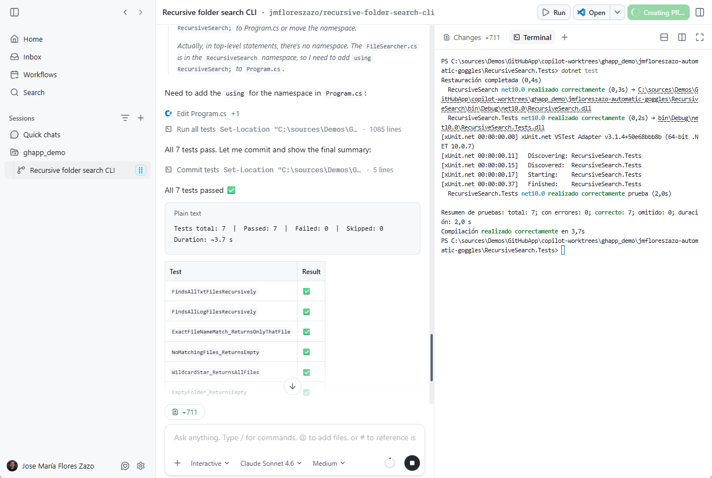

The agent ran `dotnet test` in the integrated terminal and the result was:

```
Test summary: total: 7; failed: 0; succeeded: 7; skipped: 0
Duration: 2.0 s
Build succeeded in 3.7 s
```

The 7 defined tests cover the key scenarios:

| Test | Verifies |
|---|---|
| `FindsAllTxtFilesRecursively` | Glob pattern in nested directories |
| `FindsAllLogFilesRecursively` | Glob pattern with a different extension |
| `ExactFileNameMatch_ReturnsOnlyThatFile` | Exact name match |
| `NoMatchingFiles_ReturnsEmpty` | No results when there is no match |
| `WildcardStar_ReturnsAllFiles` | `*` returns every file |
| `EmptyFolder_ReturnsEmpty` | Empty root folder returns nothing |
| `FindsFileInDeeplyNestedDirectory` | Traversal reaches deep subdirectories |

3. **The PR is prepared from the app**  
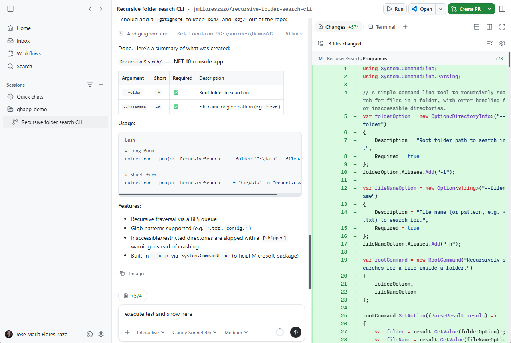

The PR is prepared from the app with a complete and well-structured description.

4. **Squash and merge is confirmed**  
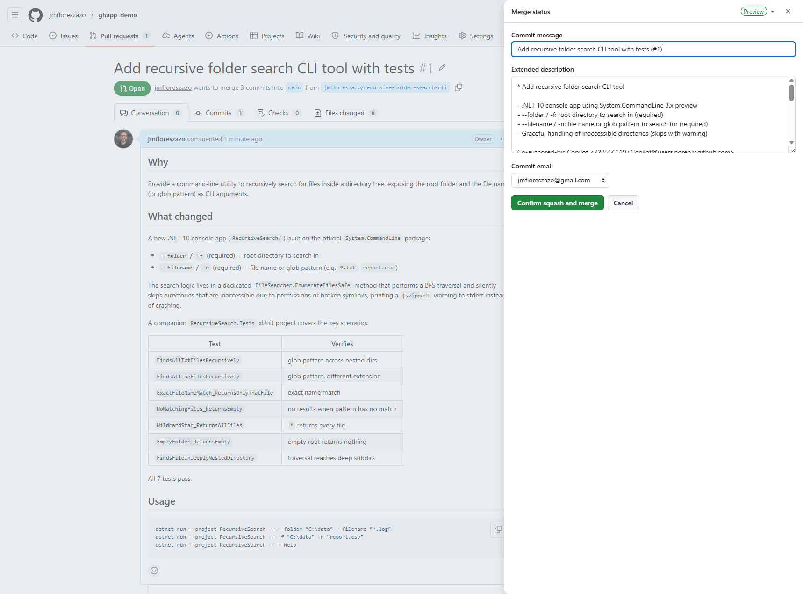

From the PR on GitHub, the merge is done with **Squash and merge**.

5. **The PR is marked as Merged**  
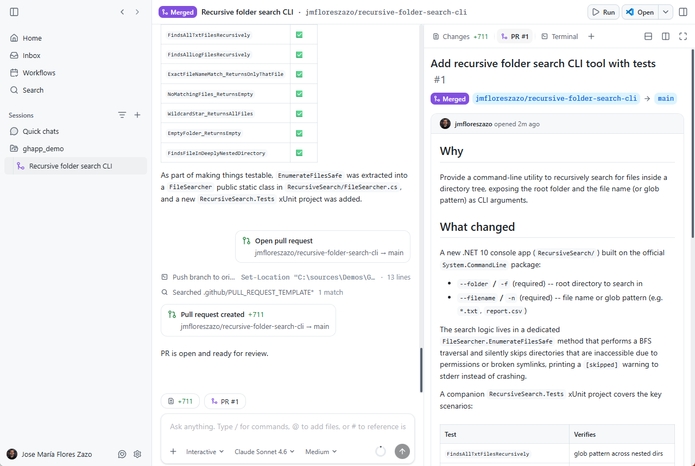

After the merge, the PR shows status **Merged** and the integration into `main` is confirmed.

6. **Final state is reviewed in the app**  
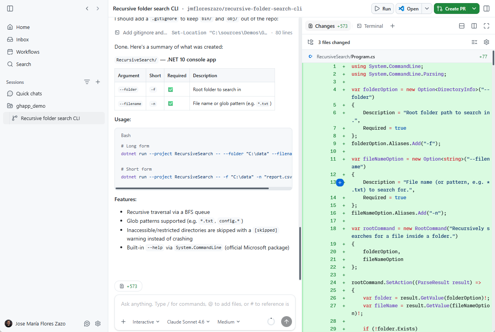

The right panel toggles between **Changes**, **PR #1**, and **Terminal**, with the full session history.

---

## ⚠️ Microsoft/GitHub's master move: a statement of intent

Let me be direct: this is not just another tool. It's a statement of intent.

For months we've watched agent-first development tools proliferate: **Claude Code** (Anthropic), **Cursor**, **Windsurf**, **Aider**, **Codeium**, **Devin**... All share the same approach: an agent that writes code on your machine or in a remote sandbox and hands you back the result. Useful, yes. But all of them have the same structural problem: **they live outside the platform where real development happens**.

GitHub Copilot App doesn't. And that difference changes everything.

### The fragmentation nobody had solved

A developer's real flow isn't "writing code." It's:

```
Issue → branch → code → tests → PR → review → comments → fix → merge
```

With any other agent-first tool, that flow is broken in at least three places. The agent generates code in the editor, but then you have to open GitHub to create the PR, go back to the terminal to run the tests, respond to comments manually, and do the merge. AI helps in the narrowest segment (writing code) and leaves you alone for the rest.

> **Important note** — As you've seen across the previous steps, you can hop between tools without any friction: work **online** (GitHub web, mobile via `/remote`), **locally** (isolated worktree), in **VS Code**, in **Terminal/PowerShell**, or from the **app** itself. The session is the same everywhere, so you can move between modes without any noise or loss of context.

### What makes this app different

| Capability | Claude Code | Cursor / Windsurf | Devin | **GitHub Copilot App** |
|---|---|---|---|---|
| Writes code agentically | ✅ | ✅ | ✅ | ✅ |
| Runs tests in integrated terminal | ✅ | ✅ | ✅ | ✅ |
| Per-session isolated worktrees | ❌ | ❌ | ✅ (sandbox) | ✅ |
| Opens PR from the same UI | ❌ | ❌ | ✅ | ✅ |
| Reads issues and GitHub context | ❌ | ❌ | Partial | ✅ native |
| Manages PR reviews | ❌ | ❌ | ❌ | ✅ (Agent Merge) |
| CI/CD integrated in the flow | ❌ | ❌ | ❌ | ✅ |
| Opens VS Code / Terminal / PowerShell | N/A | N/A | ❌ | ✅ |
| Project-specialized skills | ❌ | ❌ | ❌ | ✅ |
| Works from GitHub web and mobile | ❌ | ❌ | ❌ | ✅ (`/remote`) |

### The structural advantage: the platform

Here is the key no competitor can replicate in the short term: **GitHub is the platform**. Not an external client connecting to the platform. The platform itself.

- **Claude Code** is brilliant in the terminal, but doesn't know there's an open PR with unresolved comments. You need to switch contexts.
- **Cursor and Windsurf** are excellent AI-augmented editors, but their scope ends at the file. The PR, the issue, CI... it's all external.
- **Devin** was the first to demonstrate the concept of an end-to-end autonomous agent, but it runs in an isolated environment that isn't your real stack, with limited access to the GitHub ecosystem and no native integration into the review flow.
- **Antigravity, Bolt, v0**... live in the rapid UI prototyping segment, a different lane.

GitHub Copilot App, by contrast, starts from where your work already is: **the issue already exists, the repo already exists, the branch policies already exist, the reviewers already exist**. The agent doesn't need you to explain the context; it reads it directly.

### Agent-first as it was meant to be

The phrase "agent-first" has been devalued by overuse. Everyone claims to be it. But true agent-first means the agent can complete a task end-to-end without you having to be the glue between tools.

This app pulls it off because it can:

1. Read the issue → understand what needs doing
2. Create the isolated worktree → break nothing
3. Write the code → with visible reasoning
4. Fix compilation errors → without intervention
5. Run tests → verify everything works
6. Open the PR with a complete description → on GitHub
7. Respond to review comments → Agent Merge
8. Perform the merge when CI passes → end-to-end

No other tool covers all 8 points natively. This one does.

### Role matters: the app adapts to you

Another design win that goes unnoticed: **the app doesn't impose a single flow**. Depending on your role and how you work, you can:

- Stay in the **app** if you're a tech lead supervising and reviewing
- Jump to **VS Code** if you prefer to inspect code in your editor
- Go to the **terminal** if you need to run your own commands
- Go straight to **GitHub.com** if your flow lives in the browser
- Access from **mobile** if you just want to check the status of a session

It's not a walled garden. It's a hub that connects to the tools you already use, but can run completely on its own if you let it.

### ✨ The new Agents window in VS Code (Preview)

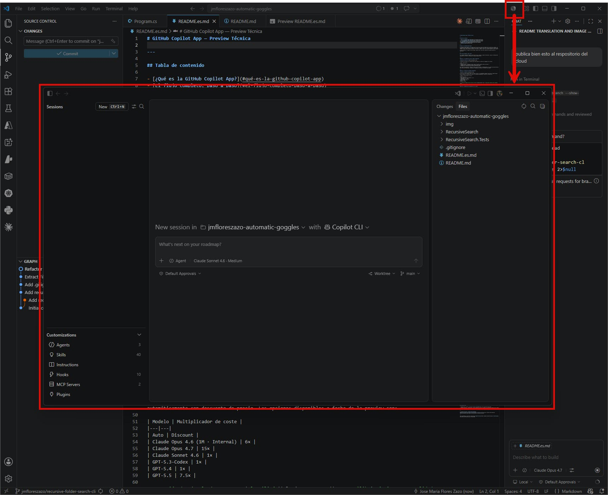

Microsoft just shipped another piece that fits perfectly into this flow: the **VS Code Agents window**, a **dedicated, decoupled-from-the-editor window** designed for a native agent-first workflow inside VS Code.

🔗 Official docs: [code.visualstudio.com/docs/copilot/agents/agents-window](https://code.visualstudio.com/docs/copilot/agents/agents-window)

What it brings and why it matters for what this guide describes:

- **Editor-independent window** — launched with `code --agents` or from the *Open in Agents* button. Runs alongside your normal VS Code without cluttering the main workspace.
- **Shared sessions** — the same Copilot CLI, Copilot Cloud, or Claude agent session in the app, in VS Code, and in the Agents window. No context duplication, no lost history.
- **Parallel multi-project** — sessions list grouped by workspace; switch between projects without opening a window per project.
- **Worktree or folder isolation** — the same isolation guarantees we already saw in Step 5, selectable when starting each session.
- **Sub-sessions** — spin up parallel tasks within the same worktree without contaminating the main chat.
- **Remote sessions via SSH or dev tunnel** — the agent runs on another machine (specialized hardware, specific environments) while you just supervise.
- **Changes panel with diff, Add Feedback, Commit/Merge/Discard** — review and approval integrated, no jumping to another tool.
- **Tasks, integrated terminal and integrated browser** — validate the change (build, tests, `localhost`) without leaving the window.
- **Customizations at hand** — Agents, Skills, Instructions, Hooks, MCP Servers, and Plugins in a dedicated panel.

In practice it reinforces exactly the thesis of this guide: **you choose where you want to live** — the GitHub Copilot App, VS Code editor, the new Agents window, terminal, GitHub.com, or mobile — and the session follows you. It's the missing piece for a truly integrated agent-first experience inside the editor.

### Conclusion

Microsoft and GitHub had the platform. They always had it. What they were missing was the agentic layer to unify it. Now they have it, and they've built it in a way competitors can't replicate just by adding features: they would need to own GitHub. And there's only one GitHub.

This doesn't mean Claude Code, Cursor, or the rest will disappear — each has its niches and strengths — but in the specific segment of **agentic development integrated with the full software lifecycle**, the GitHub Copilot App has just raised the bar very high.

---

## Full flow summary

```
Configure project (instructions, skills, branch)
        ↓
Launch session with natural-language prompt
        ↓
The agent creates an isolated worktree + writes code
        ↓
Compilation and automatic error correction
        ↓
Test execution (all pass: 7/7)
        ↓
Commit + open PR with full description
        ↓
Review / Squash and merge
        ↓
Code in main ✓
```

---

## Availability

- **Copilot Pro / Pro+**: [request early access](https://gh.io/github-copilot-app)
- **Copilot Business / Enterprise**: progressive rollout during the week of 2026-05-14 (requires the admin to enable previews and Copilot CLI in policies)
- **Official documentation**: [gh.io/github-copilot-app-docs-main](https://gh.io/github-copilot-app-docs-main)

---

🔗 **Official source**: [github.blog/changelog/2026-05-14-github-copilot-app-is-now-available-in-technical-preview](https://github.blog/changelog/2026-05-14-github-copilot-app-is-now-available-in-technical-preview/)

---

*Guide written by Jose María Flores Zazo · [@jmfloreszazo](https://github.com/jmfloreszazo) · [jmfloreszazo.com](https://jmfloreszazo.com) · May 2026*
